layout: true
  
<div class="my-header"></div>

<div class="my-footer">
  <table>
    <tr>
      <td style="text-align:right">Sächsische Landesbibliothek – Staats- und Universitätsbibliothek</td>
      <td>27. Februar 2024</td>
      <td style="text-align:right"><a href="https://www.slub-dresden.de/">www.slub-dresden.de</a></td>
    </tr>
    <tr>
      <td style="text-align:right"></td>
      <td />
    </tr>
  </table>
</div>

<div class="my-title-footer">
  <table>
    <tr>
      <td style="text-align:left"><b>Robert Sachunsky, Markus Weigelt</b></td>
      <td style="text-align:left"><b></b></td>
      <td style="text-align:left"><b>Kay-Michael Würzner</b></td>
    </tr>
    <tr>
      <td style="text-align:left">Abteilung Informationstechnologie</td>
      <td style="text-align:left"></td>
      <td style="text-align:left">Abteilung Benutzung und Information</td>
    </tr>
    <tr>
      <td style="font-size:8pt"><b>27. Februar 2024</b></td>
    </tr>
    <tr>
      <td style="font-size:8pt">DHd 2024</td>
    </tr>
  </table>
</div>

---

class: title-slide
count: false

# Edierst Du noch oder trainierst Du schon?
## Datenmanagement für Trainingsdaten für die automatische Texterkennung

---

# Overview

- Prinzipien der automatischen Texterkennung
- Wege zur *Ground Truth*
- **Datenmangement für Trainingsdaten**  
  (praktischer Teil)
- Trainingseffekte
- Diskussion, Ausblick und ein Wort zu Transkribus

---

class: part-slide
count: false

# Prinzipien der automatischen Texterkennung

---

# Prinzipien der automatischen Texterkennung

.cols[
.sixty[
- Bilderfassung ≠ Texterfassung
- **O**ptical **C**haracter **R**ecognition:  
  automatische Erkennung von Text in Bildern
- ursprünglich begrenzt auf Zeichenerkennung
- heute häufig Synonym für den gesamten Texterfassungsprozess
  + Bildvorverarbeitung
  + Layoutanalyse (OLR)
  + Zeilenerkennung
  + ...
]
.fourty[
<center></center>
]
]

---

# Prinzipien der automatischen Texterkennung

.cols[
.fifty[
]
.fourty[
<p style="margin-top:-20px">

</p>
]
]

---

count: false

# Prinzipien der automatischen Texterkennung

.cols[
.fifty[
- Bildvorverarbeitung
]
.fourty[
<p style="margin-top:-20px">

</p>
]
]

---

count: false

# Prinzipien der automatischen Texterkennung

.cols[
.fifty[
- Bildvorverarbeitung
]
.fourty[
<p style="margin-top:-20px">

</p>
]
]

---

count: false

# Prinzipien der automatischen Texterkennung

.cols[
.fifty[
- Bildvorverarbeitung
- Layoutanalyse
]
.fourty[
<p style="margin-top:-20px">

</p>
]
]

---

count: false

# Prinzipien der automatischen Texterkennung

.cols[
.fifty[
- Bildvorverarbeitung
- Layoutanalyse
]
.fourty[
<p style="margin-top:-20px">

</p>
]
]

---

count: false

# Prinzipien der automatischen Texterkennung

.cols[
.fifty[
- Bildvorverarbeitung
- Layoutanalyse
    * **strukturierende** Elemente
        + Absätze
        + Überschriften
]
.fourty[
<p style="margin-top:-20px">

</p>
]
]

---

count: false

# Prinzipien der automatischen Texterkennung

.cols[
.fifty[
- Bildvorverarbeitung
- Layoutanalyse
    * **strukturierende** Elemente
        + Absätze
        + Überschriften
    * **textflussunterbrechende** Elemente
        + Seitenzahlen
        + Kolumnentitel
        + Abbildungsunterschriften
        + Marginalien etc.
]
.fourty[
<p style="margin-top:-20px">

</p>
]
]

---

count: false

# Prinzipien der automatischen Texterkennung

.cols[
.fifty[
- Bildvorverarbeitung
- Layoutanalyse
    * **strukturierende** Elemente
        + Absätze
        + Überschriften
    * **textflussunterbrechende** Elemente
        + Seitenzahlen
        + Kolumnentitel
        + Abbildungsunterschriften
        + Marginalien etc.
    * **nichttextuelle** Elemente
        + Abbildungen
        + Tabellen etc.
]
.fourty[
<p style="margin-top:-20px">

</p>
]
]

---

count: false

# Prinzipien der automatischen Texterkennung

.cols[
.fifty[
- Bildvorverarbeitung
- Layoutanalyse
    * **strukturierende** Elemente
        + Absätze
        + Überschriften
    * **textflussunterbrechende** Elemente
        + Seitenzahlen
        + Kolumnentitel
        + Abbildungsunterschriften
        + Marginalien etc.
    * **nichttextuelle** Elemente
        + Abbildungen
        + Tabellen etc.
- Texterkennung
]
.fourty[
<p style="margin-top:-20px">
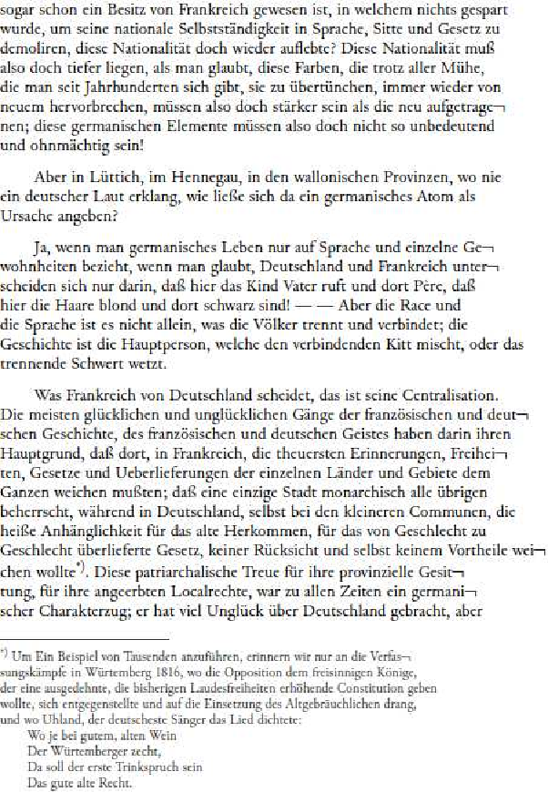
</p>
]
]

---

# Prinzipien der automatischen Texterkennung

- Erkennung erfolgt *zeilenweise*
  1. **Skalierung:** einheitliche Höhe für alle Zeilen
  2. **Merkmalsextraktion**: Raster mit fester Anzahl (horizontaler) Zeilen und variabler Anzahl (vertikaler) Spalten → Zeilen als Folgen binärwertiger Merkmalvektoren
<center></center>
- kontextsensitive Erkennung aus erlernten *Übergangswahrscheinlichkeiten* zwischen Vektoren
- Zerlegung der Seite in *Zeilen* notwendig
- robuster gegenüber Varianz durch Artefakte als Erkennung einzelner Zeichen
- `Tesseract`, `OCRopus`, `Kraken`, `Calamari`
  + Einsatz *neuronaler Netze* für Bilderkennung und Folgeklassifikation

---

# Prinzipien der automatischen Texterkennung

- zentrales Verfahren des maschinellen Lernens  
  (cf. e.g. [Xing et al. 2010](https://www.cs.sfu.ca/~jpei/publications/Sequence%20Classification.pdf))
- basierend auf dem **Satz von Bayes**: `\(P(C|E) = \frac{P(E|C)\cdot P(C)}{P(E)}\)`
- Rezept
    + Man nehme
        * eine **sehr große** Liste **manuell annotierter** Daten und
        * einen **Trainingsalgorithmus**,
    + modelliere eine **`n:n`-Beziehung** zwischen Eingabe und Ausgabe,
        * z.B. jedes Eingabeelement (Zeichen) wird auf eine Klasse abgebildet
    + induziere ein **statistisches Modell**,
    + und evaluiere dessen Qualität anhand von **Evaluationsdaten**

---

# Prinzipien der automatischen Texterkennung

.cols[
.sixty[
- Übertragung auf OCR
    + Daten
        * manuell transkribierte Textzeilen
    + Kodierung `\(f: \mathbb{N}^{10}\rightarrow\mathbb{B}\)` 
      $$
      f(x[n]) = \begin{cases} 1 & \text{Pixel in Zelle $(x,n)$ schwarz} \\\\
      0 & \, \text{sonst}\end{cases}
      $$ 
    + Training
        * Zählen von Paaren aus Vektorfolgen und Zeichenfolgen
        * Berechnen von Wahrscheinlichkeiten
        * Repräsentation als OCR-Modell
]
.thirty[
<center>
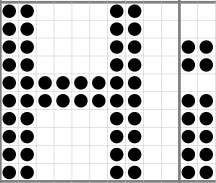
</center>
```
  0123456789
0 1100001100
1 1100001100
2 1100001100 
3 1100001100 
4 1111111100 
5 1111111100 
6 1100001100
7 1100001100
8 1100001100 
9 1100001100 
```
]
]

---

# Prinzipien der automatischen Texterkennung

- schrittweise Verarbeitung

<center>
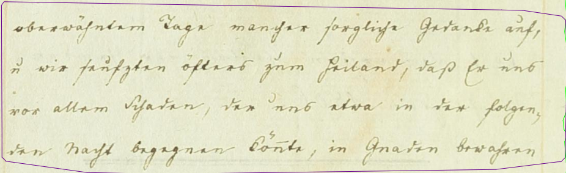
</center>
<center>
<p>↓</p>
</center>
<center>
<p style="display: inline-block; text-align: left; font-size: 16pt.; font-style: italic;">
oberwähntem Tage mancher sorgliche Gedanke auf,<br/>
&amp; wir seufzten öfters zum Heiland, daß Er uns<br/>
vor allem Schaden, der uns etwa in der folgen-<br/>
den Nacht begegnen könnte, in Gnaden bewahren
</p>
</center>

---

# Prinzipien der automatischen Texterkennung

- Schritt 1: Zeilenerkennung
    + **regelbasierte** (Bildmorphologie) oder
    + **datengetriebene** Verfahren (e.g. Pixelklassifikation)

<center>

</center>
<center>
<p>↓</p>
</center>
<center>
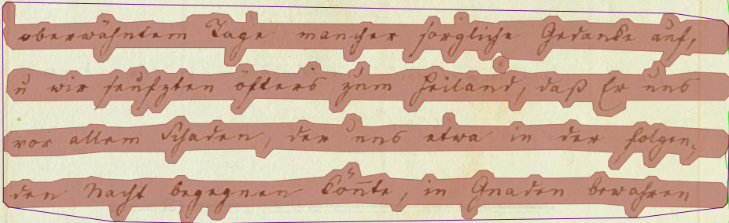
</center>

---

# Prinzipien der automatischen Texterkennung

- Schritt 2: Vektorisierung
    + **Skalierung** auf einheitliche Höhe
    + **Unterteilung** in 1 Pixel breite Streifen

<center>

</center>
<center>
<p>↓</p>
</center>
<center>
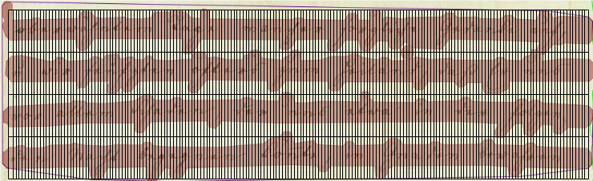
</center>

---

# Prinzipien der automatischen Texterkennung

- Schritt 3: Zeichenerkennung
    + **Übergangswahrscheinlichkeiten** zwischen Vektoren
    + Rückgriff auf (vorab) trainiertes **Modell**

<center>

</center>
<center>
<p>↓</p>
</center>
<center>
<p style="display: inline-block; text-align: left; font-size: 16pt.; font-style: italic;">
oberwähntem Tage mancher sorgliche Gedanke auf,<br/>
&amp; wir seufzten öfters zum Heiland, daß Er uns<br/>
vor allem Schaden, der uns etwa in der folgen-<br/>
den Nacht begegnen könnte, in Gnaden bewahren
</p>
</center>

---

# Prinzipien der automatischen Texterkennung

- einheitliches Paradigma für automatische Erkennung  
  von Druck und **Handschrift** (und Noten etc.)
  + Training: auf Zeilenebene zugeordnete Bild-Text-Paare
- bei Handschriften jedoch höhere **Varianz**…
  + Gestalt (Hand vs. Schriftart)
  + Materialität (Stift, Feder, Papier, Presse)
  + Aufwand (Notiz, Brief, Zeitung, Festschrift ...)

.cols[
.sixty[
<center>
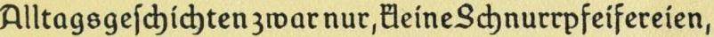
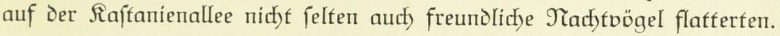
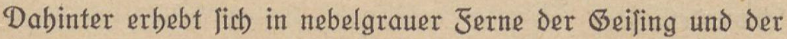
</center>
]
.fourty[
<center>
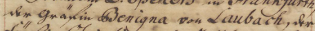
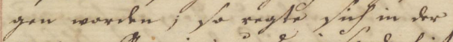

</center>
]
]

---

# Prinzipien der automatischen Texterkennung

- Trainingsdaten-Quantität bei Handschrift
  + größere Menge an Trainingsdaten (intra-individuelle Varianz)
  + schlechtere Übertragbarkeit trainierter Modelle (inter-individuelle Varianz)
- Trainingsdaten-Qualität bei Handschrift
  + (teilweise) schwerer zu lesendes Ausgangsmaterial
  + komplexe Aufbereitung für Training wegen aufwendigerer Segmentierung

<center>
  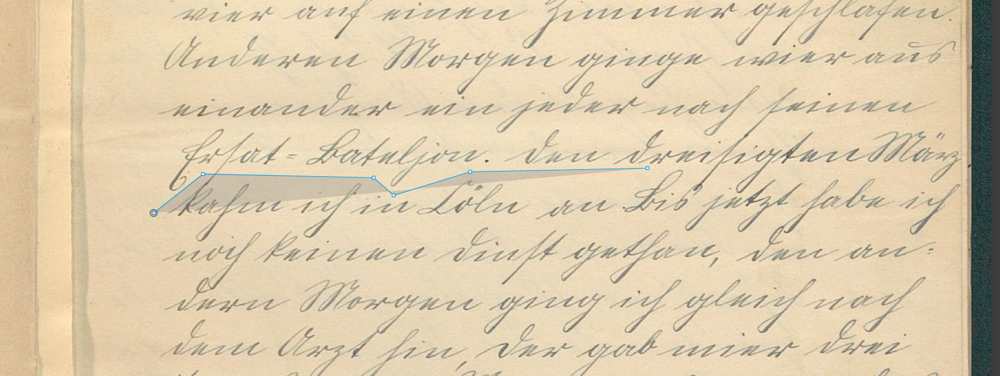
  <p>
  Annotation mit <a href="https://ocr.slub-dresden.de/Larex/">LAREX</a>
  </p>
</center>

---

count: false

# Prinzipien der automatischen Texterkennung

- Trainingsdaten-Quantität bei Handschrift
  + größere Menge an Trainingsdaten (intra-individuelle Varianz)
  + schlechtere Übertragbarkeit trainierter Modelle (inter-individuelle Varianz)
- Trainingsdaten-Qualität bei Handschrift
  + (teilweise) schwerer zu lesendes Ausgangsmaterial
  + komplexe Aufbereitung für Training wegen aufwendigerer Segmentierung

<center>
  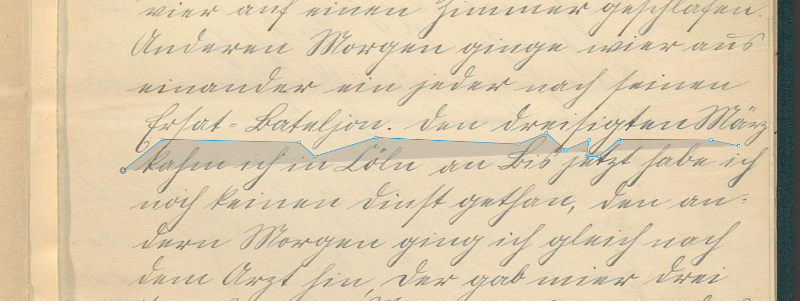
  <p>
  Annotation mit <a href="https://ocr.slub-dresden.de/Larex/">LAREX</a>
  </p>
</center>

---

count: false

# Prinzipien der automatischen Texterkennung

- Trainingsdaten-Quantität bei Handschrift
  + größere Menge an Trainingsdaten (intra-individuelle Varianz)
  + schlechtere Übertragbarkeit trainierter Modelle (inter-individuelle Varianz)
- Trainingsdaten-Qualität bei Handschrift
  + (teilweise) schwerer zu lesendes Ausgangsmaterial
  + komplexe Aufbereitung für Training wegen aufwendigerer Segmentierung

<center>
  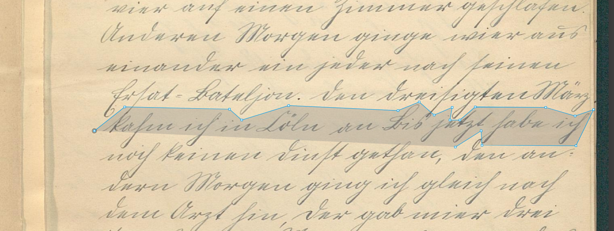
  <p>
  Annotation mit <a href="https://ocr.slub-dresden.de/Larex/">LAREX</a>
  </p>
</center>

---

count: false

# Prinzipien der automatischen Texterkennung

- Trainingsdaten-Quantität bei Handschrift
  + größere Menge an Trainingsdaten (intra-individuelle Varianz)
  + schlechtere Übertragbarkeit trainierter Modelle (inter-individuelle Varianz)
- Trainingsdaten-Qualität bei Handschrift
  + (teilweise) schwerer zu lesendes Ausgangsmaterial
  + komplexe Aufbereitung für Training wegen aufwendigerer Segmentierung

<center>
  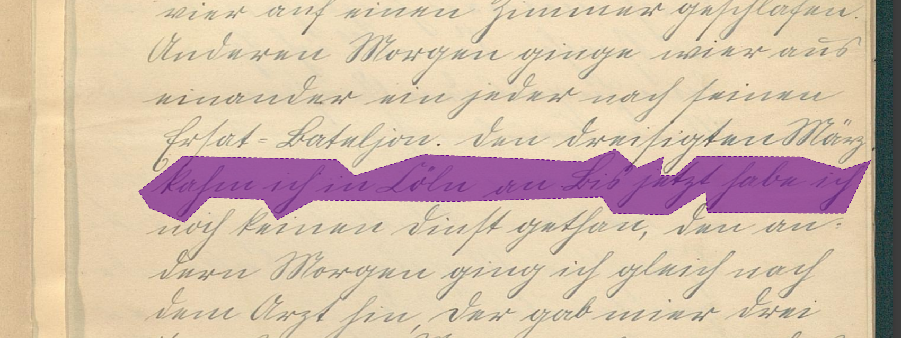
  <p>
  Annotation mit <a href="https://ocr.slub-dresden.de/Larex/">LAREX</a>
  </p>
</center>

---

class: part-slide

# Wege zur *Ground Truth*

---

# Wege zur *Ground Truth*

## Prinzipien

- kollaboratives Arbeiten
  - Einteilung, Planung, Überwachung
  - Spezialisierung in Teilaufgaben
  - gegenseitiges Überprüfen (Double Keying)
- manuellen Anteil minimieren
  - automatische Layoutanalyse – nur Segmente korrigieren
  - automatische Zeichenerkennung – nur Transkription korrigieren
- iteratives Vorgehen  
  (besseres Modell für jeweils nächste Daten)

---

# Wege zur *Ground Truth*

- Workflows...
- Tools...

---

class: part-slide

# Forschungsdatenmanagement für OCR-Trainingsdaten

---

# Forschungsdatenmanagement für OCR-Trainingsdaten

1. auf Github.com anmelden
2. [GT-Repo-Template](https://github.com/OCR-D/gt-repo-template) benutzen
3. ein oder mehrere Datenpakete herunterladen und entpacken:
   | --- | --- | --- | --- |
   | [GN_1765_1_GN_A_109](https://datashare.tu-dresden.de/s/HXJZATYJjqtK5mT)   | [GN_1771_4_GN_A_158](https://datashare.tu-dresden.de/s/SdkxJECoFLBTQ6W)   | [GN_1774_3_GN_A_171](https://datashare.tu-dresden.de/s/iz3BWgTd7omokHL)   | [GN_1806_4_GN_A_354](https://datashare.tu-dresden.de/s/Qk5CcMMsSB4TcBJ) |
   | [GN_1765_2_GN_A_110](https://datashare.tu-dresden.de/s/8Crrz3n7fYmEsm2)   | [GN_1773_3_GN_A_167](https://datashare.tu-dresden.de/s/k6jB9ptiSCXoNCZ)   | [GN_1788_5_GN_A_250](https://datashare.tu-dresden.de/s/HkD5moecjHwMkQk)   | [GN_1807_1_GN_A_355](https://datashare.tu-dresden.de/s/BQ8Jj8kcWcqxxTA) |
   | [GN_1770_2_GN_A_148](https://datashare.tu-dresden.de/s/JwfRKSEprykdkTK)   | [GN_1774_2_GN_A_170](https://datashare.tu-dresden.de/s/qZr7gACfAzePzmi)   | [GN_1806_1_GN_A_351](https://datashare.tu-dresden.de/s/E8RxqcgXXEFFXbx)   | |
4. Dateien im Repo unter `data/` per _Add file | Upload files_ hochladen 
6. [GT-Metadaten-Formular](https://tboenig.github.io/gt-metadata/document-your-gt.html) ausfüllen
7. generierte `METADATA.yml` per _Add file_ hochladen
8. eine Release `v1.0.0` anlegen und Github Action abwarten
9. ...

---

class: part-slide

# Trainingseffekte

---

# Trainingseffekte

## Vorgehen

- fester, randomisierter, repräsentativer **Schnitt**  
  (Lernstichprobe-Prüfstichprobe)
- Überwachung von Trainings- und **Testfehlerrate**  
  Optimierung der Hyperparameter
- Anwendung des neuen Modells, **Alignierung**  
  Vergleich Transkription-Prädiktion
- Auswertungen...

---

# Trainingseffekte

## Auswertungen

- Ausreißer und Varianz  
  → Lücken und Fehler (in Segmentierung oder Transkription)
- Konfusionstabelle, Kreuz-Histogramm  
  → Konsistenz, Einhaltung der Transkriptionsrichtlinien
- Unterschiede zwischen Prädiktion (OCR) und Transkription (GT)  
  → Konsolidierung (OCR-Schwachstellen, GT-Flüchtigkeitsfehler)
- Aufteilung in bekannte Untermengen  
   → Repräsentativität und Generalisierbarkeit (z.B. Schreiber, Materialität)

---

# Trainingseffekte

## Auswertungsbsp.: Schreiber
  
| **Menge** | **Zeilen** | **CER [%]** | 
| --- | --- | --- |
| alles | 19618 | 1.6 |
| train | 17622 | 1.4 |
| val | 1996 | 3.3 |
| train Hand 1 | 710 | **5.1** |
| val Hand 1 | 64 | 3.1 |
| train Hand 3 | 3179 | 2.8 |
| val Hand 3 | 447 | 3.9 |
| train Hand 4 | 1650 | 2.9 |
| val Hand 4 | 313 | **8.3** |
| train Hand 11 | 474 | **0.3** |
| val Hand 11 | 142 | 2.5 |
| train Hand 13 | 3926 | 0.2 |
| val Hand 13 | 447 | 0.9 |
| train Hand 14 | 328 | 0.5 |
| val Hand 14 | 59 | 2.9 |


---

class: part-slide

# Vielen Dank für Ihre Aufmerksamkeit!

<center>
<a href="https://wrznr.github.io/gt-management-dhd-2024/">wrznr.github.io/gt-management-dhd-2024</a>
</center>
