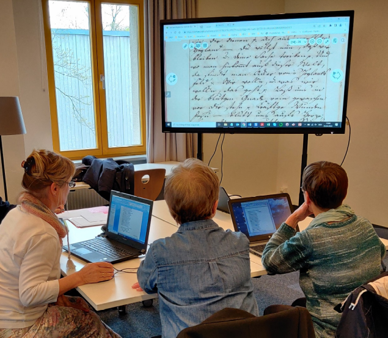

layout: true
  
<div class="my-header"></div>

<div class="my-footer">
  <table>
    <tr>
      <td style="text-align:right">Sächsische Landesbibliothek – Staats- und Universitätsbibliothek</td>
      <td>27. Februar 2024</td>
      <td style="text-align:right"><a href="https://www.slub-dresden.de/">www.slub-dresden.de</a></td>
    </tr>
    <tr>
      <td style="text-align:right"></td>
      <td />
    </tr>
  </table>
</div>

<div class="my-title-footer">
  <table>
    <tr>
      <td style="text-align:left"><b>Robert Sachunsky, Markus Weigelt</b></td>
      <td style="text-align:left"><b></b></td>
      <td style="text-align:left"><b>Kay-Michael Würzner</b></td>
    </tr>
    <tr>
      <td style="text-align:left">Abteilung Informationstechnologie</td>
      <td style="text-align:left"></td>
      <td style="text-align:left">Abteilung Benutzung und Information</td>
    </tr>
    <tr>
      <td style="font-size:8pt"><b>27. Februar 2024</b></td>
    </tr>
    <tr>
      <td style="font-size:8pt">DHd 2024</td>
    </tr>
  </table>
  <p>
    <a href="https://wrznr.github.io/gt-management-dhd-2024">wrznr.github.io/gt-management-dhd-2024</a>
  </p>
</div>

---

class: title-slide
count: false

# Edierst Du noch oder trainierst Du schon?
## Datenmanagement für Trainingsdaten für die automatische Texterkennung


---

# Overview

- Prinzipien der automatischen Texterkennung
- Wege zur *Ground Truth*
- **Datenmangement für Trainingsdaten**  
  (praktischer Teil)
- Trainingseffekte
- Wege zur *Ground Truth*, revisited

---

class: part-slide
count: false

# Prinzipien der automatischen Texterkennung

---

# Prinzipien der automatischen Texterkennung

.cols[
.sixty[
- Bilderfassung ≠ Texterfassung
- **O**ptical **C**haracter **R**ecognition:  
  automatische Erkennung von Text in Bildern
- ursprünglich begrenzt auf Zeichenerkennung
- heute häufig Synonym für den gesamten Texterfassungsprozess
  + Bildvorverarbeitung
  + Layoutanalyse (OLR)
  + Zeilenerkennung
  + ...
]
.fourty[
<center></center>
]
]

---

# Prinzipien der automatischen Texterkennung

.cols[
.fifty[
]
.fourty[
<p style="margin-top:-20px">

</p>
]
]

---

count: false

# Prinzipien der automatischen Texterkennung

.cols[
.fifty[
- Bildvorverarbeitung
]
.fourty[
<p style="margin-top:-20px">

</p>
]
]

---

count: false

# Prinzipien der automatischen Texterkennung

.cols[
.fifty[
- Bildvorverarbeitung
]
.fourty[
<p style="margin-top:-20px">

</p>
]
]

---

count: false

# Prinzipien der automatischen Texterkennung

.cols[
.fifty[
- Bildvorverarbeitung
- Layoutanalyse
]
.fourty[
<p style="margin-top:-20px">

</p>
]
]

---

count: false

# Prinzipien der automatischen Texterkennung

.cols[
.fifty[
- Bildvorverarbeitung
- Layoutanalyse
]
.fourty[
<p style="margin-top:-20px">

</p>
]
]

---

count: false

# Prinzipien der automatischen Texterkennung

.cols[
.fifty[
- Bildvorverarbeitung
- Layoutanalyse
    * **strukturierende** Elemente
        + Absätze
        + Überschriften
]
.fourty[
<p style="margin-top:-20px">

</p>
]
]

---

count: false

# Prinzipien der automatischen Texterkennung

.cols[
.fifty[
- Bildvorverarbeitung
- Layoutanalyse
    * **strukturierende** Elemente
        + Absätze
        + Überschriften
    * **textflussunterbrechende** Elemente
        + Seitenzahlen
        + Kolumnentitel
        + Abbildungsunterschriften
        + Marginalien etc.
]
.fourty[
<p style="margin-top:-20px">

</p>
]
]

---

count: false

# Prinzipien der automatischen Texterkennung

.cols[
.fifty[
- Bildvorverarbeitung
- Layoutanalyse
    * **strukturierende** Elemente
        + Absätze
        + Überschriften
    * **textflussunterbrechende** Elemente
        + Seitenzahlen
        + Kolumnentitel
        + Abbildungsunterschriften
        + Marginalien etc.
    * **nichttextuelle** Elemente
        + Abbildungen
        + Tabellen etc.
]
.fourty[
<p style="margin-top:-20px">

</p>
]
]

---

count: false

# Prinzipien der automatischen Texterkennung

.cols[
.fifty[
- Bildvorverarbeitung
- Layoutanalyse
    * **strukturierende** Elemente
        + Absätze
        + Überschriften
    * **textflussunterbrechende** Elemente
        + Seitenzahlen
        + Kolumnentitel
        + Abbildungsunterschriften
        + Marginalien etc.
    * **nichttextuelle** Elemente
        + Abbildungen
        + Tabellen etc.
- Texterkennung
]
.fourty[
<p style="margin-top:-20px">

</p>
]
]

---

# Prinzipien der automatischen Texterkennung

- Erkennung erfolgt *zeilenweise*
  1. **Skalierung:** einheitliche Höhe für alle Zeilen
  2. **Merkmalsextraktion**: Raster mit fester Anzahl (horizontaler) Zeilen und variabler Anzahl (vertikaler) Spalten → Zeilen als Folgen binärwertiger Merkmalvektoren
<center></center>
- kontextsensitive Erkennung aus erlernten *Übergangswahrscheinlichkeiten* zwischen Vektoren
- Zerlegung der Seite in *Zeilen* notwendig
- robuster gegenüber Varianz durch Artefakte als Erkennung einzelner Zeichen
- `Tesseract`, `OCRopus`, `Kraken`, `Calamari`
  + Einsatz *neuronaler Netze* für Bilderkennung und Folgeklassifikation

---

# Prinzipien der automatischen Texterkennung

- zentrales Verfahren des maschinellen Lernens  
  (cf. e.g. [Xing et al. 2010](https://www.cs.sfu.ca/~jpei/publications/Sequence%20Classification.pdf))
- basierend auf dem **Satz von Bayes**: `\(P(C|E) = \frac{P(E|C)\cdot P(C)}{P(E)}\)`
- Rezept
    + Man nehme
        * eine **sehr große** Liste **manuell annotierter** Daten und
        * einen **Trainingsalgorithmus**,
    + modelliere eine **`n:n`-Beziehung** zwischen Eingabe und Ausgabe,
        * z.B. jedes Eingabeelement (Zeichen) wird auf eine Klasse abgebildet
    + induziere ein **statistisches Modell**,
    + und evaluiere dessen Qualität anhand von **Evaluationsdaten**

---

# Prinzipien der automatischen Texterkennung

.cols[
.sixty[
- Übertragung auf OCR
    + Daten
        * manuell transkribierte Textzeilen
    + Kodierung `\(f: \mathbb{N}^{10}\rightarrow\mathbb{B}\)` 
      $$
      f(x[n]) = \begin{cases} 1 & \text{Pixel in Zelle $(x,n)$ schwarz} \\\\
      0 & \, \text{sonst}\end{cases}
      $$ 
    + Training
        * Zählen von Paaren aus Vektorfolgen und Zeichenfolgen
        * Berechnen von Wahrscheinlichkeiten
        * Repräsentation als OCR-Modell
]
.thirty[
<center>

</center>
```
  0123456789
0 1100001100
1 1100001100
2 1100001100 
3 1100001100 
4 1111111100 
5 1111111100 
6 1100001100
7 1100001100
8 1100001100 
9 1100001100 
```
]
]

---

# Prinzipien der automatischen Texterkennung

- schrittweise Verarbeitung

<center>

</center>
<center>
<p>↓</p>
</center>
<center>
<p style="display: inline-block; text-align: left; font-size: 16pt.; font-style: italic;">
oberwähntem Tage mancher sorgliche Gedanke auf,<br/>
&amp; wir seufzten öfters zum Heiland, daß Er uns<br/>
vor allem Schaden, der uns etwa in der folgen-<br/>
den Nacht begegnen könnte, in Gnaden bewahren
</p>
</center>

---

# Prinzipien der automatischen Texterkennung

- Schritt 1: Zeilenerkennung
    + **regelbasierte** (Bildmorphologie) oder
    + **datengetriebene** Verfahren (e.g. Pixelklassifikation)

<center>

</center>
<center>
<p>↓</p>
</center>
<center>

</center>

---

# Prinzipien der automatischen Texterkennung

- Schritt 2: Vektorisierung
    + **Skalierung** auf einheitliche Höhe
    + **Unterteilung** in 1 Pixel breite Streifen

<center>

</center>
<center>
<p>↓</p>
</center>
<center>

</center>

---

# Prinzipien der automatischen Texterkennung

- Schritt 3: Zeichenerkennung
    + **Übergangswahrscheinlichkeiten** zwischen Vektoren
    + Rückgriff auf (vorab) trainiertes **Modell**

<center>

</center>
<center>
<p>↓</p>
</center>
<center>
<p style="display: inline-block; text-align: left; font-size: 16pt.; font-style: italic;">
oberwähntem Tage mancher sorgliche Gedanke auf,<br/>
&amp; wir seufzten öfters zum Heiland, daß Er uns<br/>
vor allem Schaden, der uns etwa in der folgen-<br/>
den Nacht begegnen könnte, in Gnaden bewahren
</p>
</center>

---

# Prinzipien der automatischen Texterkennung

- einheitliches Paradigma für automatische Erkennung  
  von Druck und **Handschrift** (und Noten etc.)
  + Training: auf Zeilenebene zugeordnete Bild-Text-Paare
- bei Handschriften jedoch höhere **Varianz**…
  + Gestalt (Hand vs. Schriftart)
  + Materialität (Stift, Feder, Papier, Presse)
  + Aufwand (Notiz, Brief, Zeitung, Festschrift ...)

.cols[
.sixty[
<center>


</center>
]
.fourty[
<center>


</center>
]
]

---

# Prinzipien der automatischen Texterkennung

- Trainingsdaten-Quantität bei Handschrift
  + größere Menge an Trainingsdaten (intra-individuelle Varianz)
  + schlechtere Übertragbarkeit trainierter Modelle (inter-individuelle Varianz)
- Trainingsdaten-Qualität bei Handschrift
  + (teilweise) schwerer zu lesendes Ausgangsmaterial
  + komplexe Aufbereitung für Training wegen aufwendigerer Segmentierung

<center>
  
  <p>
  Annotation mit <a href="https://ocr.slub-dresden.de/Larex/">LAREX</a>
  </p>
</center>

---

count: false

# Prinzipien der automatischen Texterkennung

- Trainingsdaten-Quantität bei Handschrift
  + größere Menge an Trainingsdaten (intra-individuelle Varianz)
  + schlechtere Übertragbarkeit trainierter Modelle (inter-individuelle Varianz)
- Trainingsdaten-Qualität bei Handschrift
  + (teilweise) schwerer zu lesendes Ausgangsmaterial
  + komplexe Aufbereitung für Training wegen aufwendigerer Segmentierung

<center>
  
  <p>
  Annotation mit <a href="https://ocr.slub-dresden.de/Larex/">LAREX</a>
  </p>
</center>

---

count: false

# Prinzipien der automatischen Texterkennung

- Trainingsdaten-Quantität bei Handschrift
  + größere Menge an Trainingsdaten (intra-individuelle Varianz)
  + schlechtere Übertragbarkeit trainierter Modelle (inter-individuelle Varianz)
- Trainingsdaten-Qualität bei Handschrift
  + (teilweise) schwerer zu lesendes Ausgangsmaterial
  + komplexe Aufbereitung für Training wegen aufwendigerer Segmentierung

<center>
  
  <p>
  Annotation mit <a href="https://ocr.slub-dresden.de/Larex/">LAREX</a>
  </p>
</center>

---

count: false

# Prinzipien der automatischen Texterkennung

- Trainingsdaten-Quantität bei Handschrift
  + größere Menge an Trainingsdaten (intra-individuelle Varianz)
  + schlechtere Übertragbarkeit trainierter Modelle (inter-individuelle Varianz)
- Trainingsdaten-Qualität bei Handschrift
  + (teilweise) schwerer zu lesendes Ausgangsmaterial
  + komplexe Aufbereitung für Training wegen aufwendigerer Segmentierung

<center>
  
  <p>
  Annotation mit <a href="https://ocr.slub-dresden.de/Larex/">LAREX</a>
  </p>
</center>

---

class: part-slide
count: false

# Wege zur *Ground Truth*

---

# Wege zur *Ground Truth*

.cols[
.sixty[
- Ziel: (nahezu) fehlerfrei transkribierte Volltexte **und** deren Lokalisierung auf dem entsprechenden Digitalisat
    * Unterteilung in drei jeweils Teile
        + ~80 % **Trainingsdaten**: Schätzung der **Modellparameter** (=Übergangswahrscheinlkn.)
        + ~10 % **Validierungsdaten**: Schätzung der **Hyperparameter** (=Modellarchitektur)
        + ~10 % **Testdaten**: Überprüfung der **Güte** der Schätzung
- Rezept
    * Zeilen markieren
    * Text abschreiben
    * Ground Truth extrahieren
]
.fourty[
<center>

</center>
]
]

---

count: false

# Wege zur *Ground Truth*

.cols[
.sixty[
- Ziel: (nahezu) fehlerfrei transkribierte Volltexte **und** deren Lokalisierung auf dem entsprechenden Digitalisat
    * Unterteilung in drei jeweils Teile
        + ~80 % **Trainingsdaten**: Schätzung der **Modellparameter** (=Übergangswahrscheinlkn.)
        + ~10 % **Validierungsdaten**: Schätzung der **Hyperparameter** (=Modellarchitektur)
        + ~10 % **Testdaten**: Überprüfung der **Güte** der Schätzung
- Rezept
    * Zeilen markieren
    * Text abschreiben
    * Ground Truth extrahieren
]
.fourty[
<center>
  
</center>


]
]

---

# Wege zur *Ground Truth*: Prinzipien

* kollaboratives Arbeiten
    + Einteilung, Planung, Überwachung
    + Spezialisierung in Teilaufgaben
    + gegenseitiges Überprüfen (*Double Keying*)
* manuellen Anteil minimieren
    + automatische Layoutanalyse – nur Segmente korrigieren
    + automatische Zeichenerkennung – nur Transkription korrigieren
* iteratives Vorgehen  
    + besseres Modell für jeweils nächste Daten
* **offene Datenkultur**

---

# Wege zur *Ground Truth*: Workflows

* manuelle Segmentierung weniger fehleranfällig,  
  dafür sehr zeitaufwendig
* Transkription im **Double-Keying**-Verfahren
* abweichende Zeilen entfernen oder (wenn >2)
  - Kontrollentscheid
  - Mehrheitsentscheid

<center>
<a href="img/Normalvorgehen.svg"></a>
</center>

---

# Wege zur *Ground Truth*: Werkzeuge

* GUI für Segment- und Texterkennung und -korrektur, z.B.
    + [OCR4all](https://www.ocr4all.org/)
    + [eScriptorium](https://escriptorium.openiti.org/)
    + ([Transkribus](https://readcoop.eu/de/transkribus/))
* Publikationsinfrastruktur
    + [HTR-United](https://htr-united.github.io/)
    + [Zenodo](https://zenodo.org/communities/ocr_models/records)
    + [**OCR-D-GT**](https://github.com/OCR-D/gt-repo-template)


---

# Wege zur *Ground Truth*: [OCR4all](https://www.ocr4all.org/)

* Software zur Struktur- und Volltexterstellung
* manuelle und automatische Annotation, werkspez. Training
* mit Calamari+Tesseract als OCR-Engine, LAREX als GT-Editor

<center>

</center>

---

count: false

# Wege zur *Ground Truth*: [OCR4all](https://www.ocr4all.org/)

* Software zur Struktur- und Volltexterstellung
* manuelle und automatische Annotation, werkspez. Training
* mit Calamari+Tesseract als OCR-Engine, LAREX als GT-Editor

<center>

</center>

---

count: false

# Wege zur *Ground Truth*: [OCR4all](https://www.ocr4all.org/)

* Software zur Struktur- und Volltexterstellung
* manuelle und automatische Annotation, werkspez. Training
* mit Calamari+Tesseract als OCR-Engine, LAREX als GT-Editor

<center>

</center>


---

# Wege zur *Ground Truth*: [eScriptorium](https://escriptorium.openiti.org/)

* Software zur Struktur- und Volltexterstellung
* manuelle und automatische Annotation, werkspez. Training
* mit Kraken als OCR-Engine, enthält GT-Editor


---

count: false

# Wege zur *Ground Truth*: [eScriptorium](https://escriptorium.openiti.org/)

* Software zur Struktur- und Volltexterstellung
* manuelle und automatische Annotation, werkspez. Training
* mit Kraken als OCR-Engine, enthält GT-Editor


---

count: false

# Wege zur *Ground Truth*: [eScriptorium](https://escriptorium.openiti.org/)

* Software zur Struktur- und Volltexterstellung
* manuelle und automatische Annotation, werkspez. Training
* mit Kraken als OCR-Engine, enthält GT-Editor


---

# Wege zur *Ground Truth*: [Transkribus](https://readcoop.eu/de/transkribus/)

* Software zur Struktur- und Volltexterstellung
* manuelle und automatische Annotation, bel. Training
* mit HTR+ und PyLaia als OCR-Engine, enthält GT-Editor

<table>
  <tr>
    <td>
      
    </td>
    <td>
      
    </td>
  </tr>
</table>

---

# Wege zur *Ground Truth*: Werkzeugvergleich

| **Werkzeug** | **Offenheit** | **Datenformate** | **UM** | **VC** | **SX** | **Vorverarbeitung** | **Training** | 
| --- | --- | --- | --- | --- | --- | --- | --- |
| **OCR4all** | Code, Modelle | METS, PAGE | nein | nein | nein | OLR, OCR | OCR (werkspez.) |
| **eScriptorium** | Code, Modelle | IIIF, (PAGE), (ALTO) | ja | ja | ja | OLR, OCR | OLR, OCR (werkspez.) |
| **Transkribus** | - | (PAGE), ALTO | ja | nein | ja$ | OLR, OCR| OLR, OCR |

- UM: Kollaboration
- VC: Versionsverwaltung
- SX: Durchsuchbarkeit

<!--
* Adressierbarkeit
* persistente Identifizierung
-->

---

class: part-slide
count: false

# Forschungsdatenmanagement für OCR-Trainingsdaten

---

# FDM für OCR-Trainingsdaten

1. auf Github.com anmelden
2. [OCR-D/GT-Repo-Template](https://github.com/OCR-D/gt-repo-template) benutzen
3. ein oder mehrere Datenpakete herunterladen und entpacken:
   <table style="font-size: small; text-align: left">
   <tr>
     <td> 
       <a href="https://datashare.tu-dresden.de/s/QeaxBZJ4Ar7sMBJ">GN_1765_1_GN_A_109</a>
      </td>
     <td>
       <a href="https://datashare.tu-dresden.de/s/Aiw8S8dTmwsbYyD">GN_1771_4_GN_A_158</a>
     </td>
     <td>
       <a href="https://datashare.tu-dresden.de/s/ZjA3L58XRC3gkbk">GN_1774_3_GN_A_171</a>
      </td>
      <td>
       <a href="https://datashare.tu-dresden.de/s/yxKAeCqntT6NDWM">GN_1806_4_GN_A_354</a>
      </td>  
   </tr>
   <tr>
    <td>
     <a href="https://datashare.tu-dresden.de/s/i6Gr9HopFBRpSrZ">GN_1765_2_GN_A_110</a>
    </td>
    <td>
      <a href="https://datashare.tu-dresden.de/s/CPszGte6fwkPLS2">GN_1773_3_GN_A_167</a>
    </td>
    <td>
      <a href="https://datashare.tu-dresden.de/s/roL4EBNoEXmzTfo">GN_1788_5_GN_A_250</a>
    </td>
    <td>
      <a href="https://datashare.tu-dresden.de/s/cFrQ782YBkyRo9Q">GN_1807_1_GN_A_355</a>
    </td>  
   </tr>
   <tr>
     <td>
      <a href="https://datashare.tu-dresden.de/s/MDoxTSMArWqTo8b">GN_1770_2_GN_A_148</a>
     </td>
     <td>
      <a href="https://datashare.tu-dresden.de/s/PfrmtYoqd6iajK4">GN_1774_2_GN_A_170</a>
     </td>
     <td>
      <a href="https://datashare.tu-dresden.de/s/sX7XH9QKpjgSeeW">GN_1806_1_GN_A_351</a>
     </td>  
   </tr>  
   </table>
4. Dateien im Repo unter `data/` per _Add file | Upload files_ hochladen 
5. [GT-Metadaten-Formular](https://tboenig.github.io/gt-metadata/document-your-gt.html) ausfüllen
6. generierte `METADATA.yml` per _Add file_ hochladen
7. eine Release `v1.0.0` anlegen und Github Action abwarten
8. Deployment ansehen und Release-Assets herunterladen
9. (`METADATA.yml` bei [HTR-United](https://htr-united.github.io/#provide-data) 
   per [_PR_](https://docs.github.com/en/pull-requests/collaborating-with-pull-requests/proposing-changes-to-your-work-with-pull-requests/creating-a-pull-request) 
   [registrieren](https://github.com/HTR-United/htr-united/tree/master/catalog))

---

class: part-slide
count: false

# Trainingseffekte

---

# Trainingseffekte: Vorgehen

- repräsentative **Auswahl** der Ground-Truth  
  (ggf. Mischung mehrerer Quellen/Dokumente)
- fester, randomisierter **Schnitt**  
  (Lernstichprobe-Prüfstichprobe)
- Überwachung von Trainings- und **Testfehlerrate**  
  Optimierung der Hyperparameter
- Anwendung des neuen Modells, **Alignierung**  
  Vergleich Transkription-Prädiktion
- Auswertung...

---

# Trainingseffekte: Training

.cols[
.fourty[

- Vorverarbeitung, Bereinigung, Normalisierung ...
- Bsp. [randomisierter Datenschnitt](https://github.com/bertsky/test-gt/wiki/Splitting-Dataset)
- Bsp. [Kraken Trainingsprozedur](https://github.com/bertsky/test-gt/wiki/Kraken-Training)
- Bsp. [Calamari1 Trainingsprozedur](https://github.com/bertsky/test-gt/wiki/Calamari1-Training)
- Bsp. [Tesseract Trainingsprozedur](https://github.com/bertsky/test-gt/wiki/Tesseract-Training)

]
.sixty[


]
]

---

# Trainingseffekte: Auswertungen

- Ausreißer und Varianz  
  → Lücken und **Fehler** (in Segmentierung oder Transkription)
- Konfusionstabelle, Kreuz-Histogramm  
  → **Konsistenz**, Einhaltung der [**Transkriptionsrichtlinien**](https://ocr-d.de/en/gt-guidelines/trans/)
- Unterschiede zwischen Prädiktion (OCR) und Transkription (GT)  
  → **Konsolidierung** (OCR-Schwachstellen,GT-Flüchtigkeitsfehler)
- Aufteilung in bekannte Untermengen  
   → Repräsentativität und **Generalisierbarkeit** (z.B. Schreiber, Materialität)

---

# Trainingseffekte: Auswertungsbsp. *Segmentierungsfehler*


---

# Trainingseffekte: Auswertungsbsp. *Transkriptionsrichtlinien*


---

# Trainingseffekte: Auswertungsbsp. *Transkriptionsfehler*


---

# Trainingseffekte: Auswertungsbsp. *Verwechslung von `s` und `ſ`*

<div class="cols">
<div class="fourty">
<center>

<div class="my-table"></div>

<table data-sourcepos="697:1-709:24">
<thead>
<tr data-sourcepos="697:1-697:38">
<th data-sourcepos="697:2-697:9"><strong>f#</strong></th>
<th data-sourcepos="697:11-697:18"><strong>f%</strong></th>
<th data-sourcepos="697:20-697:27"><strong>GT</strong></th>
<th data-sourcepos="697:29-697:37"><strong>OCR</strong></th>
</tr>
</thead>
<tbody>
<tr data-sourcepos="699:1-699:27">
<td data-sourcepos="699:2-699:6">696</td>
<td data-sourcepos="699:8-699:13">18.4</td>
<td data-sourcepos="699:15-699:19"><code>s</code></td>
<td data-sourcepos="699:21-699:26"><code>ſ</code></td>
</tr>
<tr data-sourcepos="700:1-700:26">
<td data-sourcepos="700:2-700:6">107</td>
<td data-sourcepos="700:8-700:12">2.8</td>
<td data-sourcepos="700:14-700:19"><code>ſ</code></td>
<td data-sourcepos="700:21-700:25"><code>s</code></td>
</tr>
<tr data-sourcepos="701:1-701:26">
<td data-sourcepos="701:2-701:5">73</td>
<td data-sourcepos="701:7-701:11">1.9</td>
<td data-sourcepos="701:13-701:17"><code>-</code></td>
<td data-sourcepos="701:19-701:25"><code>⸗</code></td>
</tr>
<tr data-sourcepos="702:1-702:24">
<td data-sourcepos="702:2-702:5">48</td>
<td data-sourcepos="702:7-702:11">1.2</td>
<td data-sourcepos="702:13-702:17"><code>m</code></td>
<td data-sourcepos="702:19-702:23"><code>n</code></td>
</tr>
<tr data-sourcepos="703:1-703:26">
<td data-sourcepos="703:2-703:5">33</td>
<td data-sourcepos="703:7-703:11">0.9</td>
<td data-sourcepos="703:13-703:19"><code>⸗</code></td>
<td data-sourcepos="703:21-703:25"><code>-</code></td>
</tr>
<tr data-sourcepos="704:1-704:24">
<td data-sourcepos="704:2-704:5">32</td>
<td data-sourcepos="704:7-704:11">0.8</td>
<td data-sourcepos="704:13-704:17"><code>u</code></td>
<td data-sourcepos="704:19-704:23"><code>n</code></td>
</tr>
<tr data-sourcepos="705:1-705:24">
<td data-sourcepos="705:2-705:5">23</td>
<td data-sourcepos="705:7-705:11">0.6</td>
<td data-sourcepos="705:13-705:17"><code>n</code></td>
<td data-sourcepos="705:19-705:23"><code>m</code></td>
</tr>
<tr data-sourcepos="706:1-706:24">
<td data-sourcepos="706:2-706:5">20</td>
<td data-sourcepos="706:7-706:11">0.5</td>
<td data-sourcepos="706:13-706:17"><code>a</code></td>
<td data-sourcepos="706:19-706:23"><code>e</code></td>
</tr>
<tr data-sourcepos="707:1-707:25">
<td data-sourcepos="707:2-707:5">19</td>
<td data-sourcepos="707:7-707:11">0.5</td>
<td data-sourcepos="707:13-707:18"><code>ö</code></td>
<td data-sourcepos="707:20-707:24"><code>o</code></td>
</tr>
<tr data-sourcepos="708:1-708:25">
<td data-sourcepos="708:2-708:5">19</td>
<td data-sourcepos="708:7-708:11">0.5</td>
<td data-sourcepos="708:13-708:18"><code>ä</code></td>
<td data-sourcepos="708:20-708:24"><code>a</code></td>
</tr>
<tr data-sourcepos="709:1-709:24">
<td data-sourcepos="709:2-709:5">19</td>
<td data-sourcepos="709:7-709:11">0.5</td>
<td data-sourcepos="709:13-709:17"><code>r</code></td>
<td data-sourcepos="709:19-709:23"><code>e</code></td>
</tr>
</tbody>
</table>

<!--
| **f#** | **f%** | **GT** | **OCR** |
| --- | --- | --- | --- |
| 696 | 18.4 | `s` | `ſ` |
| 107 | 2.8 | `ſ` | `s` |
| 73 | 1.9 | `-` | `⸗` |
| 48 | 1.2 | `m` | `n` |
| 33 | 0.9 | `⸗` | `-` |
| 32 | 0.8 | `u` | `n` |
| 23 | 0.6 | `n` | `m` |
| 20 | 0.5 | `a` | `e` |
| 19 | 0.5 | `ö` | `o` |
| 19 | 0.5 | `ä` | `a` |
| 19 | 0.5 | `r` | `e` |
-->

</center>
</div>
<div class="sixty">
<center>


<!--

-->

</center>
</div>
</div>

---

# Trainingseffekte: Auswertungsbsp. _Zeichensatz_

<div class="my-table"></div>

| **Zeichen** | **f# GT** | **f# OCR** |
| --- | --- | --- |
| \t | 22 | 0 |
| " ASCII dq | 66 | 42 |
| “ left dq | 21 | 6 |
| ” right dq | 7 | 0 |
| „ left low | 14 | 11 |
| ' | 13 | 7 |
| ʼ mod apostrophe | 1 | 0 |
| ‘ left apostrophe | 11 | 11 |
| # | 3 | 0 |
| ⁄ fraction slash | 1 | 0 |
| / slash | 95 | 80 |
| = | 1 | 0 |
| ⸗ | 4087 | 4114 |
| - fig dash | 1 | 0 |
| - n dash | 19 | 8 |
| - m dash | 31 | 33 |
| [ | 6 | 1 |
| ] | 6 | 0 |
| 〚| 34 | 5 |
| 〛| 34 | 3 |
| _ | 3 | 0 |
| &vert; | 5 | 0 |
| Å | 1 | 0 |
| Ä | 3 | 0 |
| Ö | 4 | 2 |
| Ü | 1 | 0 |
| ē | 1 | 0 |
| è | 1 | 0 |
| ᗞ | 1 | 0 |
| ℓ script l | 23 | 19 |
| ☉ | 11 | 11 |
| ☽ | 1 | 0 |
| ♂' | 2 | 0 |
| ♄ | 1 | 0 |

---

# Trainingseffekte: Auswertungsbsp. _Schreiber_

<div class="my-table"></div>

| **Menge** | **Zeilen** | **CER [%]** | 
| --- | --- | --- |
| alles | 19618 | 1.6 |
| train | 17622 | 1.4 |
| val | 1996 | **3.4** |
| train Schreiber 1 | 710 | **5.1** |
| val Schreiber 1 | 64 | 3.1 |
| train Schreiber 3 | 3179 | 2.8 |
| val Schreiber 3 | 447 | 4.0 |
| train Schreiber 4 | 1650 | 3.0 |
| val Schreiber 4 | 313 | **8.3** |
| train Schreiber 11 | 474 | **0.3** |
| val Schreiber 11 | 142 | 2.5 |
| train Schreiber 13 | 3926 | 0.2 |
| val Schreiber 13 | 447 | 0.9 |
| train Schreiber 14 | 328 | 0.5 |
| val Schreiber 14 | 59 | 2.9 |

---

class: part-slide
count: false

# Wege zur *Ground Truth* revisited

---

# Wege zur *Ground Truth* rev.

- benötigte softwaretechnische Umgebung **frei verfügbar**
    * jedoch **hochkomplexes** technisches Setting
    * gleichzeitig **manuelle** Aufwände i.A. nicht abbildbar
- Rollenaufteilung im Zusammenspiel
    * aus Technik, Datenkompetenz und Arbeitskraft

<center>

</center>

---

# Wege zur *Ground Truth* rev.: Rollenaufteilung

.cols[
.sixty[
- Arbeitskraft: Beitrag durch Freiwillige
    * (regionales) Interesse und Sichtbarkeit der Arbeit
- Technik: Optimierung der Rahmenbedingungen
    * Unterstützung manueller Arbeit durch automatische Schritte
- Datenkompetenz: Organisation der Abläufe
    * Vermittlung von Grundkenntnissen
    * Konsolidierung und Inwertsetzung der Arbeit
]
.fourty[
<center>

</center>
]
]


<!-- hier eventuell eine Folie zu weiteren begrifflichen Unterscheidungen:
- Transkriptionszwecke (Textkorpus/Digitaledition vs. Training/GT)
- Zielgruppen (nicht/professionell, Domäne/Technik)
- geschlossene vs. offene Systeme

--> 

---

# Wege zur *Ground Truth* rev.: Soldatenbriefe

- Dissertationsprojekt Soldatenbriefe Deutsch-Französischer Krieg 1870/71 (Dominik Hetjens, TU Dresden)
- Zufallsfund: bürgerwissenschaftliche Edition

<center>
<a href="img/Soldatenbriefe.svg"></a>
</center>

---

# Wege zur *Ground Truth* rev.: Alignierung

- typischer Fall: hochwertige Transkription **ohne** visuellen Bezug zum Digitalisat, z.B.
    + wissenschaftliche Edition
    + Wikisource
    + Deutsches Textarchiv
- nachträgliche Rekonstruktion:
    + OLR zur Ermittlung der Zeilenkoordinaten
    + OCR zur Ermittlung einer Referenztranskription
    + **Alignierung** beider Transkriptionen
    + nur Text-Bild-Verbindung der hochwertigen Transkription behalten

---

# Wege zur *Ground Truth* rev.: Alignierung

- direkte Tool-Unterstützung: Transkribus, **eScriptorium**:


---

count: false

# Wege zur *Ground Truth* rev.: Alignierung

- direkte Tool-Unterstützung: Transkribus, **eScriptorium**:

<center>
  
</center>


---

count: false

# Wege zur *Ground Truth* rev.: Alignierung

- direkte Tool-Unterstützung: Transkribus, **eScriptorium**:


<!-- ℓ: Suspensionsschleife -->

---

# Wege zur *Ground Truth* rev.: MKN

- Ehrenamtsprojekt *Gemeinnachrichten* (Leitung: Juan Garcés) im Rahmen des [Moravian Knowledge Network](https://dhh.hypotheses.org/)
    * gemeinschaftliche Transkription: Vermittlung von Kurrent und editorischen Grundlagen
    * Repräsentation in TEI: Vermittlung von Datenkompetenz

<center>
<a href="img/Herrnhut-Edition.svg"></a>
</center>

---

# Wege zur *Ground Truth* rev.: Podcast

- Podcast [*Alte Schriften*](https://open.spotify.com/show/4DFXzITmsHlJiwC3OsRp5l?si=_9OJbAc_TFeceTFvxzuGSA)
- zurück in Textform mittels automatischer Spracherkennung (ASR)

<center>
<a href="img/Herrnhut-Podcasts.svg"></a>
</center>

---

# Wege zur *Ground Truth* rev.: techn. Hürden

- Zielkonflikt
    + Domänenexpertise (Kurrent, Hintergrundwissen) vs.
    + rechentechnische Fertigkeiten

  → Vermeidung durch Etablierung geteilter Arbeitsabläufe

- Reduktion technischer Hürden und manuellen Aufwands
    + Transkription *ohne* Transkription
    + dafür automatisch: OLR+OCR, ASR, Alignierung

  → Kompromiss zwischen Aufwand für weitestmögliche Automatisierung und Umfang der manuellen Nachbearbeitung


---

# Wege zur *Ground Truth* rev.: Datenkultur

- GT entsteht überall!
    * meist urheberrechtlich unproblematisches Material
    * mit Mühe, Einsatz und öffentlicher Finanzierung erarbeitet
- GT ist wertvoll!
    * generalisierte Modelle mit Finetuning und iteratives Training
    * für Erschließung von Kulturerbe
- GT muss verfügbar sein!
    * Modell- und Methodentransparenz
    * maximale gegenseitige Unterstützung

---

class: part-slide

# Vielen Dank für Ihre Aufmerksamkeit!

<center>
<a href="https://wrznr.github.io/gt-management-dhd-2024/">wrznr.github.io/gt-management-dhd-2024</a>
</center>
